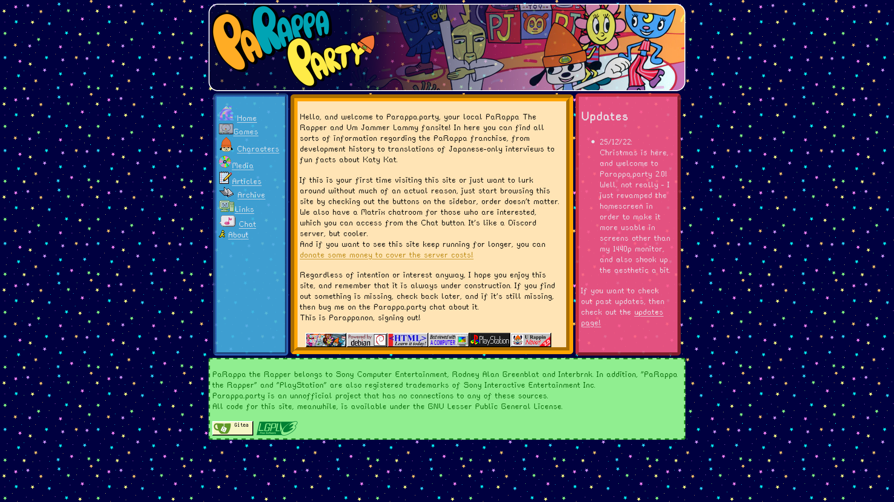

# parappa.party-new

# About Parappa.party

This is the source code for the PaRappa The Rapper fansite Parappa.party.
All code in this repository, as well as the site itself is licensed as open
source under the GNU Lesser General Public License.
Due to copyright law, however, no assets by Sony, Rodney Alan Greenblat, Fuji
TV, J.C Staff or Production IG, among others are in this repository, as all
rights are reserved to them.

# Contribute
You can contribute to parappa.party's development in many ways:
* If you know some HTML/CSS, Git or want to learn either or both of these, you
  can commit to this Gitea repository, mentioning which changes have you made.
* You can join the [Parappa.party Chat](https://matrix.to/#/#parappa-chat:parappa.party)
  to start talking to the Parappa.party team on which information or sections
  you want to be added to the site.
* You can create an issue on this very repository about whatever you might want
  Parappa.party to have
* Or E-mail the project leader, Parappanon at parappanon@airmail.cc. Don't
  worry, she doesn't bite!

No matter whether your change is big or small, once your edit is merged into
the main branch of this repository you'll be added to the Credits secton for
your contribution.

# Authors, Acknowledgement and Credits
I'm giving credits to the following, for all their contributions and
influence to the project:
 
 * To Sony, Masaya Matsuura, Rodney Alan Greenblat, Gabin Itou and everyone
 else who worked on the series at NanaOnSha, J.C Staff, Production I.G, Doga
 Kobo, Fuji TV, among others for having brought this series to life and
 worked in it so much. Without you all, this site would not even be
 concievable.
 * To Wakfu[CK], for helping with the creation and work on many parts of
 the site during its early days. 
* To prximity, for contributing to the codebase by cleaning out the HTML
and CSS code for the index page.
* To Timkho, for helping me with the extraction of the thumbnails used on the
DVD part of the PaRappa anime's section of the site.
 * To the PaRappa The Rapper community online, for having encouraged me and
 fellow contributors to keep working on the site, no matter what, regardless
of platform.
 * And to you, for your interest on this project. I don't think you'd be
 here, looking at the source code if not for such a thing.

